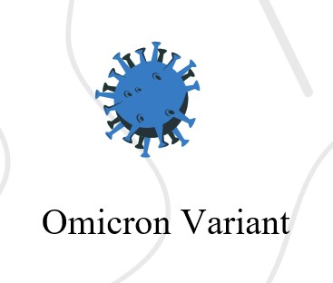
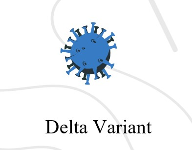

# SARS-Cov-2-Omicron-variant

 

**The out break of covid-19 in late 2019 has affected the world and people lives in many different  aspects, whether in education, economics or in the quality of life itself the damage was unbearable.**

**SARS-CoV-2 which has caused the covid-19 has many variants. Alpha, beta, gamma, delta and omicron, the main purpose of this study is to compare between the following two:**
 
 

#### [The data set used is from GISAID which is a public database for SARS-Cov2](https://gisaid.org/)

#### Comparison is done in three ways:
1. multiple sequence alignment on Delta 
2. Phylogenetic tree
3. Getting the Chemical constituents.
4. Extracting the dissimilar regions.

#### Conclusion 

1. The similarity between Omicron's sequences is very close also the similarity between Delta's sequences is very close as we can see that in the phylogenetic tree.
2.  There is a great similarity between the delta virus and the Omicron mutant, as the similarity rate is approximately 93%.
3. CG represent the stability of DNA, was low in the corona sequences that led to many variants of virus.
4. The similarity between the consensus sequence and the individual Omicron is very close so we can say that Delta and Omicron are from the same family.

